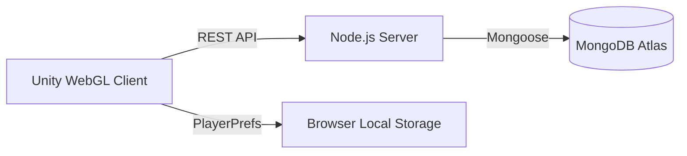

<div align="center">

# Turn-Based RPG — Unity WebGL Fullstack
**NT208.Q22 — Lập trình ứng dụng Web**
*Trường Đại học Công nghệ Thông tin — ĐHQG TP.HCM*

[](https://unity.com/)
[](https://nodejs.org/)
[](https://www.mongodb.com/)

[Giới thiệu](#-giới-thiệu) • [Tính năng](#-tính-năng-nổi-bật) • [Kiến trúc](#-kiến-trúc-hệ-thống) • [Cài đặt](#-hướng-dẫn-cài-đặt) • [Thành viên](#-thành-viên-nhóm)

</div>

---

## 📖 Giới thiệu
Dự án là một trò chơi nhập vai theo lượt (Turn-based RPG) được tối ưu hóa cho nền tảng web thông qua **Unity WebGL**. Trò chơi không chỉ tập trung vào gameplay chiến thuật mà còn tích hợp hệ thống backend mạnh mẽ để quản lý dữ liệu người chơi, đồng bộ hóa đám mây và xử lý trải nghiệm đa nền tảng.

---

## ✨ Tính năng nổi bật

### ⚔️ Hệ thống Chiến đấu Chiến thuật
- **Turn-based Logic:** Sắp xếp lượt đánh linh hoạt dựa trên chỉ số Speed (SPD).
- **Active Defense (Parry):** Cơ chế tương tác thời gian thực cho phép người chơi giảm sát thương bằng cách phản xạ trong lượt của quái vật.
- **Status Effects:** Hệ thống hiệu ứng đa dạng (Poison, Stun) ảnh hưởng trực tiếp đến chiến thuật trận đấu.
- **EXP Scaling:** Cơ chế tính điểm kinh nghiệm thông minh dựa trên cấp độ trung bình của đội hình.

### 🗺️ Khám phá Thế giới
- **Map System:** Di chuyển và tương tác trong môi trường 2D với camera zone tự động.
- **Minimap:** Hiển thị vị trí thực tế và các điểm dịch chuyển (TeleportPillar).
- **Random Encounters:** Hệ thống gặp quái ngẫu nhiên với tỉ lệ tùy biến theo khu vực.

### 📜 Hệ thống Nhiệm vụ (Questing)
- **Branching Narratives:** Cốt truyện phân nhánh dựa trên lựa chọn của người chơi thông qua `QuestBranchChoice`.
- **ScriptableObject-Driven:** Dữ liệu nhiệm vụ dễ dàng mở rộng và quản lý thông qua Editor.

### ☁️ Lưu trữ Đám mây & Persistence
- **Hybrid Sync:** Kết hợp giữa `LocalStorage` (tốc độ cao) và `MongoDB` (an toàn dữ liệu).
- **Guest Identity:** Tự động định danh thiết bị thông qua GUID, hỗ trợ lấy lại dữ liệu bằng **Transfer Code**.
- **Auto-save:** Cơ chế tự động lưu khi đóng trình duyệt hoặc đổi tab.

---

## 🏗️ Kiến trúc Hệ thống

### Sơ đồ luồng dữ liệu


### Công nghệ sử dụng
| Thành phần | Công nghệ |
| :--- | :--- |
| **Engine** | Unity 2022.3 LTS |
| **Backend** | Node.js, Express.js |
| **Database** | MongoDB (NoSQL) |
| **Frontend** | C#, Unity WebGL |
| **Networking** | UnityWebRequest (REST) |

---

## 🚀 Hướng dẫn cài đặt

### 1. Backend
```bash
cd Backend
npm install
npm start
```
*Mặc định server sẽ chạy tại `http://localhost:3000`.*

### 2. Unity Client
1. Mở project bằng **Unity Hub** (phiên bản 2022.3+).
2. Kiểm tra cấu hình `backendBaseURL` trong `GameManager` (Editor sẽ tự dùng localhost).
3. Build WebGL và xuất vào thư mục `Backend/public/`.

---

## 👥 Thành viên nhóm

| MSSV | Họ và Tên | Vai trò chính |
| :--- | :--- | :--- |
| **24520238** | **Nguyễn Mạnh Cường** | Nhóm trưởng, Gameplay Logic, AI |
| **24520262** | **Nguyễn Tấn Danh** | Gameplay Logic, Battle System |
| **24520074** | **Trầm Tĩnh An** | UI/UX Design, Audio System |
| **24520228** | **Trần Đức Chuẩn** | Database, Cloud Sync, WebGL Deploy |

---
*Dự án phục vụ mục đích học tập tại UIT. Mọi hành vi sao chép vui lòng ghi rõ nguồn.*
 va test                    | itch.io                |

---

## Giay phep

Du an nay duoc phat trien phuc vu muc dich hoc tap trong khuon kho mon hoc **NT208 — Lap trinh ung dung Web**, Truong Dai hoc Cong nghe Thong tin — DHQG TP.HCM.
