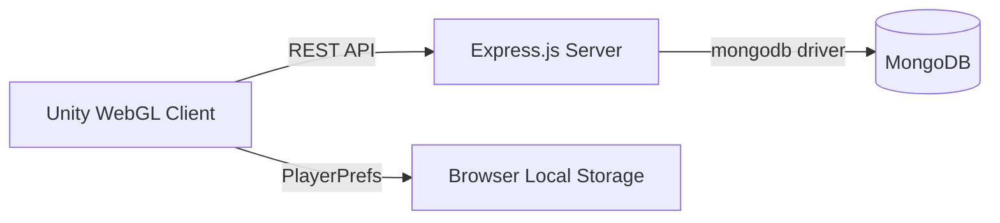

<div align="center">

# ⚔️ Hiệp Khách Trần Triều
### Turn-Based RPG — Unity WebGL Fullstack

**NT208.Q22 — Lập trình ứng dụng Web**
*Trường Đại học Công nghệ Thông tin — ĐHQG TP.HCM*

[](https://unity.com/)
[](https://nodejs.org/)
[](https://expressjs.com/)
[](https://www.mongodb.com/)
[](#-giấy-phép)

<br/>
<a href="https://github.com/Nergy197/lt-web-NT208.Q22/raw/main/HiepKhachTranTrieu.apk">
  
</a>
<br/>
<br/>

[Giới thiệu](#-giới-thiệu) • [Tính năng](#-tính-năng-nổi-bật) • [Kiến trúc](#-kiến-trúc-hệ-thống) • [Cài đặt](#-hướng-dẫn-cài-đặt) • [Demo](#-demo-video) • [Thành viên](#-thành-viên-nhóm)

</div>

---

## 📖 Giới thiệu

**Hiệp Khách Trần Triều** là một trò chơi nhập vai theo lượt (Turn-based RPG) lấy bối cảnh lịch sử, được xây dựng trên **Unity** và xuất bản dưới dạng **WebGL** để chơi trực tiếp trên trình duyệt. Dự án không chỉ tập trung vào gameplay chiến thuật mà còn tích hợp một hệ thống backend hoàn chỉnh (Node.js + MongoDB) để quản lý dữ liệu người chơi, đồng bộ hoá đám mây và đảm bảo trải nghiệm liền mạch trên đa nền tảng (Desktop / Mobile WebGL).

---

## ✨ Tính năng nổi bật

### ⚔️ Hệ thống Chiến đấu Chiến thuật
- **Turn-based Logic** — Sắp xếp lượt đánh linh hoạt dựa trên chỉ số Speed (SPD).
- **Active Defense (Parry)** — Cơ chế phản xạ thời gian thực, giảm sát thương khi đỡ đúng nhịp tấn công của quái.
- **Status Effects** — Hệ thống hiệu ứng đa dạng (Poison, Stun...) ảnh hưởng trực tiếp đến chiến thuật trận đấu.
- **EXP Scaling** — Tính điểm kinh nghiệm thông minh dựa trên cấp độ trung bình của đội hình.

### 🗺️ Khám phá Thế giới
- **Map System** — Di chuyển, tương tác trong môi trường 2D với camera zone tự động.
- **Minimap & Quest Tracker** — Hiển thị vị trí thực tế, điểm dịch chuyển (TeleportPillar) và nhiệm vụ đang theo dõi.
- **Random Encounters** — Gặp quái ngẫu nhiên với tỉ lệ tuỳ biến theo từng khu vực.

### 📜 Hệ thống Nhiệm vụ (Questing)
- **Branching Narratives** — Cốt truyện phân nhánh theo lựa chọn của người chơi (`QuestBranchChoice`).
- **ScriptableObject-Driven** — Dữ liệu nhiệm vụ được quản lý qua Editor, dễ mở rộng không cần sửa code.

### 📱 Hỗ trợ đa nền tảng
- **Mobile-ready UI** — Layout riêng cho từng scene (joystick, nút tương tác, nút chiến đấu) tự co giãn theo CanvasScaler, kiểm tra overflow trước khi build APK.
- **Input System hợp nhất** — Một bộ điều khiển dùng chung cho cả bàn phím/chuột và cảm ứng.

### ☁️ Lưu trữ & Đồng bộ dữ liệu
- **Hybrid Sync** — Kết hợp `PlayerPrefs` (local, tốc độ cao) và `MongoDB` (cloud, an toàn dữ liệu).
- **Guest Identity** — Tự sinh GUID định danh thiết bị, hỗ trợ chuyển máy bằng **Transfer Code**.
- **Auto-save** — Tự động lưu khi đóng tab/trình duyệt hoặc khi vào các điểm mốc quan trọng.

---

## 🏗️ Kiến trúc Hệ thống



### Công nghệ sử dụng

| Thành phần | Công nghệ |
| :--- | :--- |
| **Game Engine** | Unity 2022.3 LTS (C#) |
| **Client Build** | WebGL |
| **Backend** | Node.js, Express.js |
| **Database** | MongoDB (native driver) |
| **Giao tiếp** | REST API qua `UnityWebRequest` |

### Backend API chính

| Method | Endpoint | Chức năng |
| :--- | :--- | :--- |
| `GET` | `/player/:id` | Lấy dữ liệu lưu của người chơi theo ID |
| `POST` | `/player/save` | Lưu/đồng bộ dữ liệu người chơi lên server |
| `GET` | `/sync` | Đồng bộ hai chiều giữa local và cloud |

---

## 🚀 Hướng dẫn cài đặt

### 1. Backend
```bash
cd Backend
npm install
npm start
```
Server mặc định chạy tại `http://localhost:3000`. Có thể cấu hình chuỗi kết nối MongoDB qua biến môi trường `MONGO_URI`.

### 2. Unity Client
1. Mở project bằng **Unity Hub** (phiên bản 2022.3 LTS trở lên).
2. Kiểm tra `backendBaseURL` trong `GameManager` — Editor/Standalone tự dùng `localhost`, build WebGL dùng URL tương đối.
3. Build WebGL (`File → Build Settings → WebGL`) và xuất kết quả vào `Backend/public/`.
4. Chạy lại `npm start` để server vừa phục vụ API vừa serve game.

---

## 🎥 Demo Video

> 📺 **Xem demo các tính năng:** [Google Drive](https://drive.google.com/file/d/1-3WuX8OUtB5FZI5j0JjoYHk5fphC6Sf5/view?usp=drive_link)
>
> <https://drive.google.com/file/d/1-3WuX8OUtB5FZI5j0JjoYHk5fphC6Sf5/view?usp=drive_link>

---

## 👥 Thành viên nhóm

| MSSV | Họ và Tên | Vai trò chính | Tỷ lệ đóng góp |
| :--- | :--- | :---: | :---: |
| **24520238** | **Nguyễn Mạnh Cường** | Nhóm trưởng, Gameplay Logic, AI | 25% |
| **24520262** | **Nguyễn Tấn Danh** | Gameplay Logic, Battle System | 25% |
| **24520074** | **Trầm Tính Ân** | UI/UX Design, Audio System | 25% |
| **24520228** | **Trần Đức Chuẩn** | Database, Cloud Sync, WebGL Deploy | 25% |

---

## 📄 Giấy phép

Dự án được phát triển phục vụ mục đích học tập trong khuôn khổ môn học **NT208 — Lập trình ứng dụng Web**, Trường Đại học Công nghệ Thông tin — ĐHQG TP.HCM. Mọi hành vi sao chép vui lòng ghi rõ nguồn.

---

<div align="center">

Chúng em đã biết làm web và hiểu hệ thống web hoạt động như thế nào.

</div>
